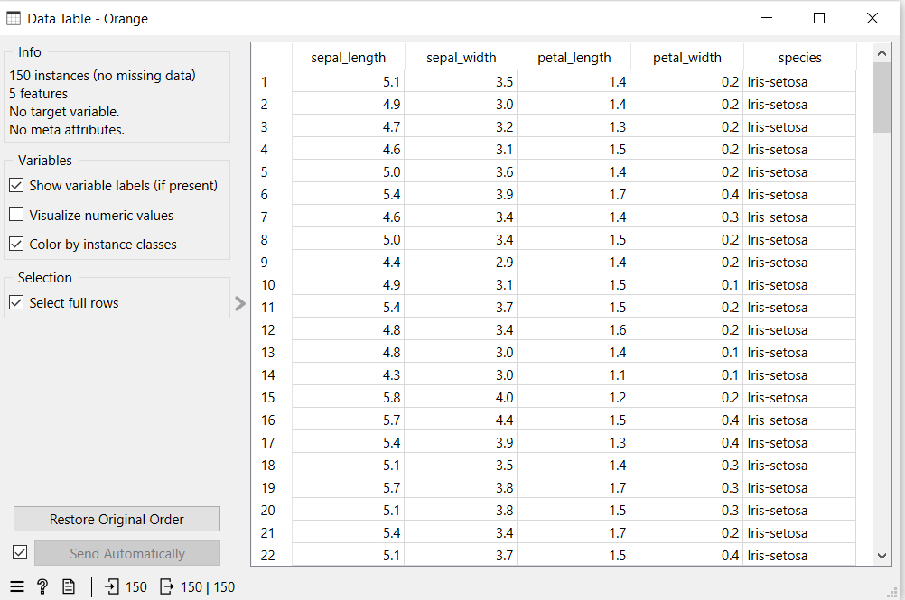

---
jupytext:
  formats: md:myst
  text_representation:
    extension: .md
    format_name: myst
    format_version: 0.13
    jupytext_version: 1.11.5
kernelspec:
  display_name: Python 3
  language: python
  name: python3
---

# Data Collection

Langkah pertama dalam Data Understanding adalah pengumpulan data (data collection). Pada tahap ini, data dikumpulkan dari berbagai sumber yang relevan, seperti database, file CSV atau Excel, API, maupun sistem internal organisasi. Maksud dari langkah ini adalah memastikan bahwa data yang digunakan sesuai dengan tujuan penelitian, lengkap, dan representatif terhadap permasalahan yang akan dianalisis. Tanpa proses pengumpulan yang tepat, hasil analisis berisiko tidak relevan dengan kebutuhan penelitian.

# Tujuan Data Collection

Berikut adalah tujuan Data Collection:

1. Memperoleh data yang relevan dengan permasalahan atau tujuan penelitian.
2. Mengumpulkan data dari sumber yang terpercaya, seperti database, file CSV/Excel, API, atau sistem internal.
3. Memastikan kelengkapan data, baik dari segi jumlah sampel maupun variabel yang dibutuhkan.
4. Menjamin data bersifat representatif, sehingga dapat menggambarkan kondisi sebenarnya.
5. Mendukung proses analisis selanjutnya, agar tahap deskripsi, eksplorasi, dan pemodelan dapat dilakukan dengan tepat.
6. Mengurangi risiko kesalahan analisis, karena data yang digunakan sudah sesuai dengan kebutuhan dan tujuan penelitian.

# Studi Kasus

Pada Studi Kasus kali ini menggunakan dataset IRIS dari kaggle:
[Iris Flower Datasest](https://www.kaggle.com/datasets/arshid/iris-flower-dataset)

```{code-cell}
import pandas as pd

df = pd.read_csv("../IRIS.csv")

df.head(150)
```


```{note} 

Didapatkan untuk dataset iris memiliki 150 Data dengan 5 fitur 

```